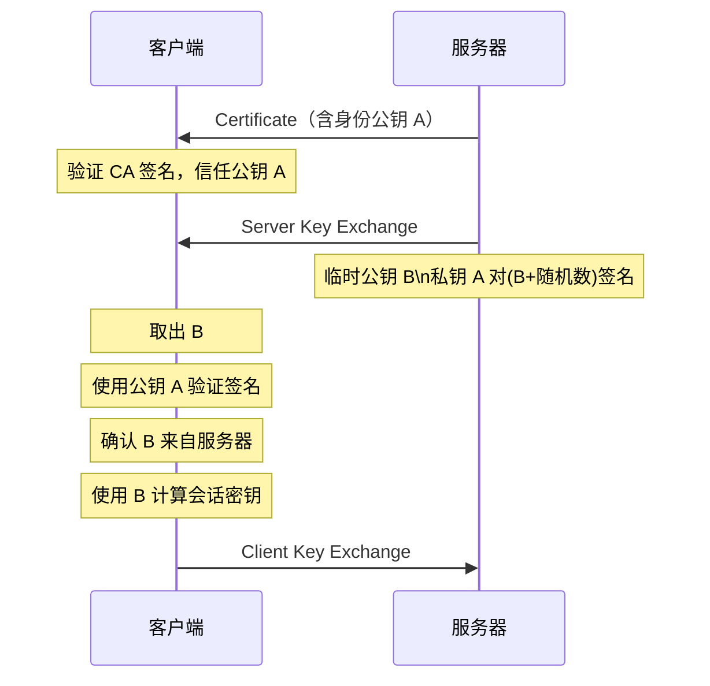

## tcp/ip 协议族分层：
| 协议层 | 协议示例 | 数据封装格式 | 主要功能描述 |
|--------|----------|--------------|--------------|
| **应用层** | FTP(file transfer protocol)、DNS(domain name system)、http(hypertext transfer protocol) | data |  |
| **传输层** | tcp(transmission control protocol)、UDP(user data protocol) | TCP 头部 + data → segment |  |
| **网络层** | ip(internet protocol) | IP 头部 + TCP 头部 + data → packet | 处理在网络上流动的数据包（网络传输的最小数据单位）；选择传输路径到达对方 |
| **数据链路层** | ARP（(address resolution protocol) | 以太网头部（含 MAC 地址）+ IP 头部 + TCP 头部 + data → frame | 处理硬件连接部分，包括控制操作系统、设备驱动、网卡（NIC (network interface card)）以及光纤等物理介质的数据帧传输 |

## 数据包是如何发送到目标ip地址？
1. 生成ip数据包
2. 判断目标ip是否在同一局域网
3. <u>在同一个局域网里的话</u>，（ARP过程）
    1. 检查缓存：先查看本地的ARP缓存表，是否有目标IP对应的MAC地址。     
    2. 发送ARP请求（广播）：如果没有，就向局域网内所有设备广播一个ARP请求包，内容是：“谁的IP地址是 XXX.XXX.XXX.XXX？请告诉 YYY.YYY.YYY.YYY（我的IP）。”
    3. 接收ARP应答（单播）：拥有该IP的设备会单播回复一个ARP应答包，内容是：“我是 XXX.XXX.XXX.XXX，我的MAC地址是 ZZ:ZZ:ZZ:ZZ:ZZ:ZZ。”
    4. 更新缓存并通信：发起方收到应答后，将IP-MAC对应关系存入ARP缓存，然后就可以封装以太网帧（源/目标MAC地址齐全）进行通信了。
4. 不在一个局域网里的话，会自动发送到默认网关，也需要通过ARP协议找到默认网关的MAC地址，完成一跳。
5. 每一跳可能会修改源mac地址/目标mac地址，但是源ip/目标ip是不变的。 

### 如何判断是否在同一局域网？-- 使用subnet mask
1. 首先了解一下internet protocol version 

| 版本 | 位数 | 现状 |
|--------|----------|--------------|
| internet protocol version 4 （ipv4） | 有32位，分段按一个字节，eg:192.168.1.1; | 目前用完了，通过<u>NAT</u>(network address translator)勉强维持 |
| ipv6 | 有128位，分段按4个字节，eg: 2001:db8:85a3::8a2e:370:7334， | 全球普及 |


2. 假设你的网络是 192.168.1.0/24（子网掩码 255.255.255.0）
其中
- 网络号：192.168.1.0（代表整个网络本身，不能分配给设备）
- 第一个可用主机地址：192.168.1.1 - 这通常就是默认网关（没规定是这个，可以改）
- 广播地址：192.168.1.255（用于广播，不能分配给设备）
- 最后一个可用主机地址：192.168.1.254
3. 把目标ip和源ip和子网掩码按位与&(只有都是1才输出1)，比较得到的是不是一样的，一样说明在一个子网里
#### NAT是如何完成的？
##### 主要原理：
运营商只给一个公网ip地址，但是家里有很多设备，每个设备有一个私网ip。
是NAT网关将私有ip地址eg:10.0.0.10 转换成全局ip地址：202.244.174.37 ，修改源地址之后再把数据转发出去。
那么接收数据也是，修改目标ip地址：全局ip地址->私有ip地址。这样网络就分成私网和公网两个部分，网络访问只能先有私网发起，公网没有办法主动访问私网主机。
##### 同时有两个私网设备建立连接的情况：
如果私网有两个主机10.0.0.10：1025和10.0.0.11：1025，要和同一个目标ip地址维持连接，而且这两个私网ip的端口还是一样的。那么会重新映射端口。可能转化的公网ip为202.244.174.37：1025和202.244.174.37：1026。这个叫NAPT(network address port translation)，理论上计算机端口16位，最多支持2^16个设备同时共用一个公网ip。
##### 路由器WAN口获得的ip一定是全球唯一公网ip吗：
移动的话是后来者，持有的IPv4地址最少，不支持一个家庭宽带用户一个ip，一般会使用双重NAT,给家里的只是一个“大内网ip”，只是运营商内部网络里的一个ip。
如果和电信/联通（它们IPv4多）说想装监控需要，要求开通公网ip，可能会同意。
但是现在！
我们有ipv6，地址海量，运营商可以直接给家里的每一台设备分配一个全球唯一的公网 IPv6 地址。
理论上可以不用NAT,你的电脑可以直接被互联网上的 IPv6 设备访问。只是路由器上可能有防火墙拦截。
##### 一般是谁来完成NAT？：
一般来说是路由器实现NAT转换，它会维护一张连接的NAT表。
光猫（optical modem）主要负责把运营商光纤传来的光信号，转换成电脑和路由器能识别的电信号（数字信号）。它自带Wi-Fi能力比较弱，穿墙差，所以一般设置成桥接模式，后面接一个路由器，让路由器负责拨号 + 路由 +Wi-Fi。
拨号（Dial-up / PPPoE）Point-to-Point Protocol over Ethernet，主要是为了验证身份和获取公网IP。维持的是长连接，运营商会经常断开，但是路由器内存里存储了我们第一次输入的账户和密码，它会自动发送重新建立连接。


## TCP
### 缩写 
提供可靠的字节流服务(byte stream service)
SYN :synchronize 
ACK:acknowledge
Message指的http传输的完整内容。
Entity指的是Message中的Payload部分。
### TCP UDP的区别
TCP 和 UDP 都是传输层协议，但它们的设计目标不同。其中，TCP 是面向连接、可靠传输的协议，而 UDP 是无连接、尽力而为的协议。
TCP 在建立连接前需要三次握手，确保双方都具备收发能力，并能协商初始序列号；而 UDP 直接发送数据，不做连接管理。
TCP 主要通过以下机制保证可靠性：
- 序列号和确认应答（ACK）
- 超时重传
- 滑动窗口流量控制
- 拥塞控制

UDP 不会维护状态，也不保证顺序或可靠性，适合实时性要求高的场景，比如视频通话、游戏等等。
至于为什么 TCP 挥手要四次，原因在于连接关闭时，通信是双向的独立通道。
当主动方发出 FIN 请求关闭时，只代表自己不再发送数据，但仍能接收对方数据。
被动方需要先确认（ACK），等自己也没有数据要发了，再发出自己的 FIN。
所以一来一回各两个方向，共四次交互。
握手只需三次是因为在建立连接阶段双方同步状态即可，不存在单向还没发完数据的情况。

### range request
成功的返回码是206 Partial Content，对于 ISO 镜像、游戏安装包、大型 PDF、云盘文件，服务器放的通常就是一个完整的物理文件。所以直接用range request。好处是网络中断也不用再从头开始下，可以指定range。

现在像youtube的话可能是把视频.mp4文件切割成非常多个小切片文件（.ts 或者 .m4s），播放器先通过 HTTP 下载一个索引文件（.m3u8 或 .mpd），然后根据网络状况，通过 HTTP GET 请求逐个下载这些小文件。每个小文件都是完整下载的（状态码 200），而不是分片下载的（206）。

## 用单台虚拟主机实现多个域名
在相同的IP地址上，可以通过虚拟主机，寄存多个不同的主机名和域名，所以发送HTTP请求的时候，要在Host首部指明完整主机名/URI。
物理上，这些不同主机名用的是一个IP a，DNS解析结果是一样的，
那么如果一个目标ip是a的请求到了，需要像Nginx之类的软件在解析的时候通过看Host确定用户请求的实际是哪个网站的资源。
### DNS
这里DNS可以做到url和ip的多对一、一对多，但是好像一个url映射到多个ip的时候，DNS也没有很好实现负载均衡。
在实际架构中，通常是 DNS + Nginx/网关 组合使用：DNS 负责把用户导流到最近的数据中心入口（Nginx 集群），然后由 Nginx 在数据中心内部进行精细化的负载均衡。

## 代理服务器
缓存代理：转发响应的时候，先把资源copy一份到缓存服务器上。
透明代理：不修改内容，只是转发。
http通信的时候，可以级联多个代理服务器，在via首部字段增加经过的主机名。
### vpn
我开始以为vpn也是只要代理级联，但其实不是。eg：cn发到jp，jp会解析数据包然后以自己作为源ip重新发一个包给us。

## 物理上网络连接
信号塔只负责把我们送到网络上，但是远距离上的物理传输，靠光纤上的光中继器和海底光缆上的海中继器，以及卫星间的激光链路。

## HTTPS 如何实现加密
TLS握手：
SSL(前身) TLS（现在一般用的）
服务器需要向ca(certificate authority)机构申请SSL证书，证明这个域名皮下的身份，并且证书包含了一对公钥和私钥。（我们相信CA这个第三方发的证书）
### 过程：
1. 客户端发送：Client Hello ，并且告诉服务端支持的TLS版本（1.2还是1.3）以及支持的加密套件（各种加密算法组合），并且生成一个随机数给服务端
2. 服务端发送: Server Hello，并且告诉客户端自己确认的TLS版本以及选择的加密套件，也生成一个随机数发送给客户端
3. 服务器再发送：Certificate,发送自己的数字证书digital certificate。客户端浏览器就可以对照自己的证书信任列表，看这个证书是否可行
4. 服务端发送：server key exchange ,把自己的公钥Pubkey给客户端
#### 客户端如何确认这个公钥是可信的？


5. 如果这个时候服务端也想要客户端的公钥，这里还要有一个发送请求 （eg:登录网银等情况下需要
6. 服务器发送：Server Hello done
7. 客户端
    1. 先发送 Client Key Exchange ;客户端生成第三个随机数（预主密钥）；并且用收到的公钥对这个随机数加密再发送给服务端;
    2. 发送Change Ciper Spec，告诉服务器之后用商议好的算法和密钥加密
    3. 发送Encrypted Handshake Message,告诉服务器自己已经准备好了
8. 服务器也发送Encrypted Handshake Message表示准备好了。TLS握手完成！
之后：服务器用私钥可以把客户端发送的与主密钥解密；这样双方都知道三个随机数；用三个随机数计算出会话密钥；最后，就可以用这个会话密钥实现对称加密！
####  验证证书链
客户端验证步骤（以 HTTPS 为例）
当你的浏览器（客户端）访问 https://www.example.com 时，会发生以下事情：
##### 第1步：证书传输
服务器将它的数字证书（以及可能的中间证书）发送给浏览器。
##### 第2步：证书验证 - 浏览器执行以下关键检查
验证证书链（信任链）
概念：全世界的 CA 有成百上千家，浏览器不可能直接信任所有。浏览器只预装了一小批最顶层的根证书颁发机构（Root CA） 的公钥。
过程：服务器证书通常不是由根 CA 直接签发的，而是由中间 CA（Intermediate CA）签发，中间 CA 的证书再由根 CA 签发。这就形成了一条“证书链”。
服务器证书 -> 由中间 CA 签名
中间 CA 证书 -> 由根 CA 签名
根 CA 证书 -> 自签名，且已预装在浏览器/操作系统的信任存储（Trust Store） 中。
**验证**：浏览器用预装的根 CA 的公钥去验证中间 CA 证书的签名；如果通过，再用中间 CA 证书的公钥去验证服务器证书的签名。只要链上所有签名都验证通过，就说明这个服务器证书是由一个可信的 CA 签发的。
**验证域名信息**
浏览器检查证书中的 Common Name 或 Subject Alternative Name 字段，看是否与正在访问的域名（www.example.com）完全匹配。如果不匹配，会显示“证书与域名不匹配”的错误。
验证有效期：浏览器检查证书的有效起止日期，确保当前时间在证书的有效期之内。如果证书已过期或尚未生效，会显示错误。
检查证书吊销状态（可选但重要）
即使证书本身有效，也有可能因为私钥泄露等原因而被发行方提前吊销。浏览器会通过以下两种方式之一检查：
CRL（证书吊销列表）：向 CA 维护的一个列表查询该证书是否已被吊销。
OCSP（在线证书状态协议）：直接向 CA 的 OCSP 服务器查询该证书的实时状态。
如果证书已被吊销，浏览器会拒绝连接。
##### 第3步：密钥交换
只有当以上所有检查都通过后，浏览器才确信证书中的公钥确实是 www.example.com 的合法公钥。随后，它才会使用这个公钥来加密后续通信的对称会话密钥（例如在 RSA 密钥交换中），或者进行椭圆曲线 Diffie-Hellman (ECDHE) 密钥交换。
CA证书 （里面重要的东西：san(subject alternative name 包含域名 ip 多个地址)，公钥，签名）
### 自建ca证书
我用tfssl自建的是CA证书 （Root CA Certificate）; 这个证书是签发其他子证书像SSL之类的。
那么自建的和公共的CA（例如Let's Encrypt、阿里云）区别就是，这些公共的CA 浏览器和操作系统都是信任的。但是我建的这个CA只有我自己信任。
1. 创建根 CA
cfssl genkey -initca root-ca.json | cfssljson -bare root-ca
2. 用根 CA 签发服务器证书
cfssl gencert -ca root-ca.pem -ca-key root-ca-key.pem server.json | cfssljson -bare server
3. 用根 CA 签发客户端证书
cfssl gencert -ca root-ca.pem -ca-key root-c

## 输出一条url发生的事情
1. 浏览器会解析url(uniform resource locator), (浏览器会自动补全协议（https://）、端口（443）、路径（/users/123）等信息。)
    1.  知道当前的协议是http、https、ftp
    2.  知道服务器的域名和监听的端口，端口https默认是443，http默认是80
    3.  知道服务器上资源的路径和查询参数
2. 浏览器查看资源缓存：
    如果请求的资源没过期，直接返给客户端，不发生请求
    过期就下一步，发送请求
3. 服务器会进行DNS域名解析
【本地DNS服务器做的递归如下：】
1️⃣ 浏览器缓存  Chrome 内存中保存最近的 DNS 记录
2️⃣ 操作系统缓存    Windows hosts 文件 or macOS/Linux 的 /etc/hosts
3️⃣ 路由器缓存  家庭路由器可能缓存常用域名
4️⃣ ISP DNS 缓存    运营商 DNS 缓存（如 114.114.114.114）
不行的话：
而Local DNS向其他服务器发起的是迭代查询：
本地 DNS 服务器
   ↓
根 DNS (.)
   ↓
顶级域 DNS (.com)
   ↓
权威 DNS (example.com 的 NS 记录)
   ↓
返回 A 记录（IP 地址，如 203.0.113.45）
4. 发送socket 完成tcp连接
Socket = IP地址 + 端口号
例如：192.168.1.100:80 或 14.215.177.38:443
TCP连接建立 = 本地Socket ↔ 远程Socket
            (192.168.1.100:54321) (14.215.177.38:80)
浏览器(客户端)                    服务器
     │                            │
     │        SYN (seq=x)         │
     │━━━━━━━━━━━━━━━━━━━━━━━━━━━→│
     │                            │
     │    SYN+ACK (seq=y,ack=x+1) │
     │←━━━━━━━━━━━━━━━━━━━━━━━━━━━│
     │                            │
     │        ACK (ack=y+1)       │
     │━━━━━━━━━━━━━━━━━━━━━━━━━━━→│
     │        连接建立            │
https的话还需要TLS握手
5. 浏览器就会构建http请求报文，通过tcp连接发送给服务器（应用层）
GET请求 带上cookie 认证信息
传输层：[TCP头部] + [HTTP报文]=[TCP报文段]
网络层：[IP头部] + [TCP报文段]=[IP数据报]
数据链路层：[帧头] + [IP数据报] + [帧尾]=[数据帧]
物理层：比特流
6. 进入网关 API Gateway
1.网关接收请求，go-zero里的gateway （要进行流量控制，负载均衡、路由、鉴权、限流、日志）
2.网关解析url,根据路由规则分发到对应微服务（商品服务A）
（如果请求需要认证）还会校验JWT Token 或者调服务做鉴权
熔断/限流：
如果服务不可用，网关直接返回错误或降级响应
商品服务A暴露的可能是gRPC/REST接口
->服务发现etcd 找到实例
->调用数据库
->把服务结果（json）返回
-> 网关可能会统一包装一下
7. 服务器接收请求并处理，会返回HTTP响应

8. 浏览器会接收html(hypertext markup language)内容，检查响应状态码和响应头

## RPC原理
简单介绍：允许一台计算机程序去调用另一台计算机的程序，但是隐藏了网络通信等细节，让程序员只要像调用本地函数一样使用。
1. 客户端代理：
客户端首先会调用代理对象，代理对象会拦截方法调用，收集 方法名 参数类型参数值等信息。这个时候真正执行的是代理对象的rpc逻辑
2. 请求序列化：
代理会把这些数据序列化成 二进制数据，例如json（文本格式但是网络传的时候会变成字符对应的二进制编码）/protobuf格式（二进制，人类不可读）。
3. 网络传输：
通过tcp或者http发送给远程服务端，一般是长连接，减少频繁握手开销
4. 服务端反序列化与调用： 
服务端收到消息，反序列化数据，从注册表里找到对应方法，通过反射执行结果并再次序列化返回
5. 客户端反序列化并读取结果
### 反射
**第一种**：有一些rpc反射是在运行时拿字符串去查表是哪个函数
**第二种**：c++ reflect 是用模板元编程，在编译时期通过constexpr if 刺探试探一个聚合类里有多少个成员。然后遇到反序列化结果后直接查编译时期建好的静态表。实现比较hack;1.编译时间会变长：使用大量的模板元编程 2.限制很多：reflect-cpp对于聚合类要求不能有虚函数、不能有自定义构造函数、不能有私有成员（或者有getter/setter）
**第三种**：元数据（Metadata）: 在编译时期生成的包含名称的数据。
一般来说程序员给变量/结构体命名是为了方便维护代码，C++为了节省二进制空间，会在编译之后丢弃名字。但是我们在把结构体序列化json文件或者日志打印结构体内容的时候，都希望能知道对应的名字。
为了实现这一点，最简单的方法是hard code,也就是手动编写元数据。但是工程变大了之后，手写会变得复杂容易出错。
这时候需要在编译前运行脚本实现元数据生成，也就是Code Generation。通过Code Gerneration实现反射的举例如下：
1. Google开发的protobuf。（主要是用于数据序列化传输以及跨语言数据交换，可以序列化成二进制文件压缩空间；但也附带实现了反射）
```bash
protoc --cpp_out=. test.proto
## 生成 test.pb.h和test.pb.cpp
```

2. Qt MOC (Meta-Object Compiler)
常用的是在类里加 Q_OBJECT  宏提示需要MOC处理

而reflect-cpp 是通过Template Metaprogramming(模板元编程)实现，优点是只需要引入头文件库，使用非常方便。

## 关于epoll
### 五种IO模型：
[1]blockingIO - 阻塞IO
[2]nonblockingIO - 非阻塞IO
[3]signaldrivenIO - 信号驱动IO
[4]asynchronousIO - 异步IO
[5]IOmultiplexing - IO多路复用
epoll 是事件驱动的IO多路复用，linux还有select poll。

用户是如何通过系统调用间接操作事件监控表的
1. 通过 epoll_create 可以创建一个epoll 实例，会返回一个epfd
2. 内核里有一颗红黑树和一个就绪链表，用户可以通过epoll_ctl（传入 epfd 和要操作的 fd）修改内核中红黑树上的监控集合
3. 当有数据传来，fd状态变成可读/可写的时候（eg:socket接收缓冲区有数据），内核会触发回调函数ep_poll_callback(),这个回调函数会把fd节点放到就绪链表里并唤醒等待进程
【这里的等待进程是说用户可能在之前调用了epoll_wait但是因为就绪链表里空的，就会进入睡眠模式】
4. 用户可以调用epoll_wait读就绪事件
【实际实现是把就绪链表拷贝到用户态，然后清空内核态的链表，但是红黑树没动，所以fd还是被监控着】
5. 这里有两种模式可配：水平触发LT 边缘触发ET
LT是只要 fd 处于可读/可写状态（例如 socket 接收缓冲区还有数据），内核会在下次 epoll_wait 时再次将该 fd 加入就绪链表（通过回调函数），并通知用户。因此，即使用户一次没有读完数据，下次 epoll_wait 还会返回这个 fd，直到数据被读完（或用户取消监控）。
 ET 模式下，内核仅在 fd 状态变化时（例如从无数据到有数据）通知一次。即使数据未读完，下次 epoll_wait 也不会返回该 fd（除非有新的数据到达，再次触发状态变化）。
因此，用户必须在收到一次事件后一次性读完所有数据（通常通过循环调用 read 直到返回 EAGAIN/EWOULDBLOCK），否则可能丢失数据。
